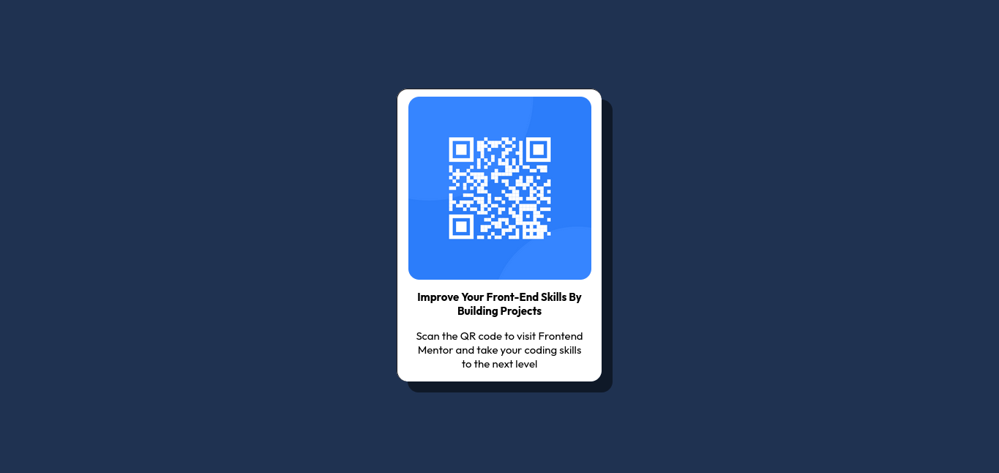

# Frontend Mentor - QR code component solution

Esta é uma solução para o [QR code component challenge on Frontend Mentor](https://www.frontendmentor.io/challenges/qr-code-component-iux_sIO_H). Os desafios do Frontend Mentor ajudam você a melhorar suas habilidades de codificação criando projetos realistas. 

## Table of contents

- [Overview](#overview)
  - [Screenshot](#screenshot)
  - [Links](#links)
- [My process](#my-process)
  - [Built with](#built-with)
- [Author](#author)

## Overview

### Screenshot

### Links

- Solution URL: [Add solution URL here](https://your-solution-url.com)

## My process

### Built with

- Semantic HTML5 markup
- CSS custom properties
- Flexbox

## Author

- Github - [Rubinho](https://github.com/Rub1nh0)
- Frontend Mentor - [@Rub1nh0](https://www.frontendmentor.io/profile/Rub1nh0)
- Twitter - [@rubsparano](https://twitter.com/rubsparano)

